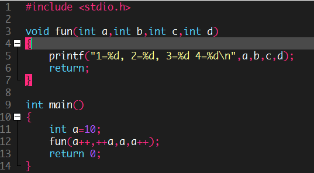
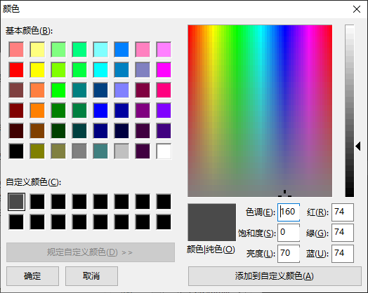

**效果图**



Dev C++ 的主题默认存储在`C:/Users//AppData/Roaming/Dev-Cpp`目录下，在该目录新建`<文件名>.syntax`添加配色。

在 Dev C++ 的菜单栏中选择`工具[T]`>`编辑器属性`>`语法`>`预设`应用配色（可在选项中找到你之前新建的配色）；同时也可直接在 Dev C++ 中方便的调色（点击右侧自动跳转到对应内容）并保存（如果文件名与已存在的相同则默认替换）。

修改完后，务必在`工具[T]`>`编辑器属性`>`基本`中更改`高亮显示当前行`的颜色，以符合背景。



另外，推荐在使用暗色主题时关闭 Dev C++ 自带的各种工具栏！

# Monokai.syntax

经典的暗色配色，来自 Github

```
[Editor.Custom]
Assembler=$0099FFFF, clNone, 0, 0, 0
Character=$0099FFFF, clNone, 0, 0, 0
Comment=$00787878, clNone, 0, 1, 0
Float=$0099FFFF, clNone, 0, 0, 0
Hexadecimal=$0099FFFF, clNone, 0, 0, 0
Identifier=clWhite, clNone, 0, 0, 0
Illegal Char=clAqua, clNone, 0, 0, 0
Number=$00FF55AA, clNone, 0, 0, 0
Octal=$0099FFFF, clNone, 0, 0, 0
Preprocessor=$007F2AFF, clNone, 0, 0, 0
Reserved Word=$00FFD455, clNone, 0, 0, 0
Space=clWindowText, $001E1E1E, 0, 0, 0
String=$0099FFFF, clNone, 0, 0, 0
Symbol=$007F2AFF, clNone, 0, 0, 0
Selected text=16777215, 5921370
Gutter=7895160, 1973790
Break points=16777215, 13209
Error Line=1973790, 10092543
Active Breakpoints=16777215, 10040115
```