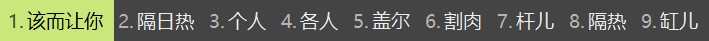

####  在weasel.custom.yaml当中添加

> 配置简析

```
customization:
  distribution_code_name: Weasel
  distribution_version: 0.14.3
  generator: "Weasel::UIStyleSettings"
  modified_time: "Sat Dec 28 21:58:37 2019"
  rime_version: 1.5.3
patch:
  "menu/page_size": 9  #候选字个数
  "style/color_scheme": TNT #定义主题名，这里指向的是下方TNT的预设
  "style/horizontal": true #排列为横向排列
  "preset_color_schemes/TNT": #预设属性
    name: "AndroidOpt" #输入法显示的方案名称
    author: "tnt q_tnt@qq.com" #作者信息
    text_color: 0xfffffff #边界颜色
    back_color: 0x99731c #候选框外的背景颜色
    candidate_text_color: 0xffffffd #候选框外的字体颜色
    border_color: 0x99731c 
    label_color: 0xb5aa8f
    hilited_text_color: 0x50c4a8d #输入字体颜色
    hilited_back_color: 0x99731c #未选中的输入字体背景色
    comment_text_color: 0xffffff
    hilited_candidate_text_color: 0xffffff
    hilited_comment_text_color: 0xffffff
    hilited_candidate_back_color: 0x50c4a8
    "style/horizontal": true
  "style/inline_preedit": true
  "style/layout/border_width": 0
  "style/layout/border": 0
  "style/layout/margin_x": 8 #候选字左右边距
  "style/layout/margin_y": 8 #候选字上下边距
  "style/layout/hilite_padding": 8 #候选字背景色色块高度 若想候选字背景色块无边界填充候选框，仅需其高度和候选字上下边距一致即可
  "style/layout/hilite_spacing": 3 # 序号和候选字之间的间隔
  "style/layout/spacing": 10 #不知道干嘛的，在weasel下好像没有效果
  "style/layout/candidate_spacing": 12 # 候选字间隔

  "style/layout/round_corner": 0 #候选字背景色块圆角幅度
```


> Android 优化版    


```yaml
customization:
  distribution_code_name: Weasel
  distribution_version: 0.14.3
  generator: "Weasel::UIStyleSettings"
  modified_time: "Sat Dec 28 21:58:37 2019"
  rime_version: 1.5.3
patch:
  "menu/page_size": 9  
  # "style/color_scheme": android
  "style/color_scheme": TNT

  "style/horizontal": true
  "preset_color_schemes/TNT":
    name: "AndroidOpt"
    author: "tnt q_tnt@qq.com"
    text_color: 0xffffff
    back_color: 0x99731c
    border_color: 0x99731c
    label_color: 0xb5aa8f
    hilited_text_color: 0x50c4a8
    hilited_back_color: 0x99731c
    candidate_text_color: 0xffffff
    comment_text_color: 0xffffff
    hilited_candidate_text_color: 0xffffff
    hilited_comment_text_color: 0xffffff
    hilited_candidate_back_color: 0x50c4a8
```


> 暗绿风


```yaml
customization:
  distribution_code_name: Weasel
  distribution_version: 0.14.3
  generator: "Weasel::UIStyleSettings"
  modified_time: "Sat Dec 28 21:58:37 2019"
  rime_version: 1.5.3
patch:
  "menu/page_size": 9  
  # "style/color_scheme": android
  "style/color_scheme": TNT

  "style/horizontal": true
  "preset_color_schemes/TNT":
    name: "blackgreen"
    author: "tnt q_tnt@qq.com"
    text_color: 0xffffff
    back_color: 0x444444
    border_color: 0x444444
    label_color: 0xcdd4d1
    hilited_text_color: 0x50c4a8
    hilited_back_color: 0x000000
    candidate_text_color: 0xcdd4d1
    comment_text_color: 0xffffff
    hilited_candidate_text_color: 0x000000
    hilited_comment_text_color: 0x000000
    hilited_candidate_back_color: 0x7be7ca
```

> 蓝色单栏风 -- 后者支持自定义


```
customization:
  distribution_code_name: Weasel
  distribution_version: 0.14.3
  generator: "Weasel::UIStyleSettings"
  modified_time: "Tue Jan 28 21:59:32 2020"
  rime_version: 1.5.3
patch:
  "menu/page_size": 9
  "style/color_scheme": psionics
  "style/horizontal": true
  "style/inline_preedit": true
  "style/layout/border": 0
  "style/layout/border_width": 0
  "style/layout/candidate_spacing": 12
  "style/layout/hilite_padding": 8
  "style/layout/hilite_spacing": 3
  "style/layout/margin_x": 8
  "style/layout/margin_y": 8
  "style/layout/round_corner": 0
  "style/layout/spacing": 10
```

```
customization:
  distribution_code_name: Weasel
  distribution_version: 0.14.3
  generator: "Weasel::UIStyleSettings"
  modified_time: "Tue Jan 28 21:59:32 2020"
  rime_version: 1.5.3
patch:
  "menu/page_size": 9
  "style/color_scheme": TNT
  "preset_color_schemes/TNT":
    text_color: 0x444444
    back_color: 0x444444
    candidate_text_color: 0xeeeeee
    comment_text_color: 0x808080
    hilited_text_color: 0xeeeeee
    hilited_back_color: 0x444444
    hilited_candidate_label_color: 0xfafafa
    hilited_candidate_text_color: 0xfafafa
    hilited_candidate_back_color: 0xd8bf00
    hilited_comment_text_color: 0x444444
  "style/horizontal": true
  "style/inline_preedit": true
  "style/layout/border": 0
  "style/layout/border_width": 0
  "style/layout/candidate_spacing": 12
  "style/layout/hilite_padding": 8
  "style/layout/hilite_spacing": 3
  "style/layout/margin_x": 8
  "style/layout/margin_y": 8
  "style/layout/round_corner": 0
  "style/layout/spacing": 10
```


> 自定义单栏风（默认绿色单栏风）



```
customization:
  distribution_code_name: Weasel
  distribution_version: 0.14.3
  generator: "Weasel::UIStyleSettings"
  modified_time: "Tue Jan 28 21:59:32 2020"
  rime_version: 1.5.3
patch:
  "menu/page_size": 9
  "style/color_scheme": TNT
  "preset_color_schemes/TNT":
    text_color: 0x444444
    back_color: 0x444444
    candidate_text_color: 0xeeeeee
    comment_text_color: 0x808080
    hilited_text_color: 0xeeeeee
    hilited_back_color: 0x444444
    hilited_candidate_label_color: 0x000000
    hilited_candidate_text_color: 0x000000
    hilited_candidate_back_color: 0x7be7ca
    hilited_comment_text_color: 0x444444
  "style/horizontal": true
  "style/inline_preedit": true
  "style/layout/border": 0
  "style/layout/border_width": 0
  "style/layout/candidate_spacing": 12
  "style/layout/hilite_padding": 8
  "style/layout/hilite_spacing": 3
  "style/layout/margin_x": 8
  "style/layout/margin_y": 8
  "style/layout/round_corner": 0
  "style/layout/spacing": 10
```

